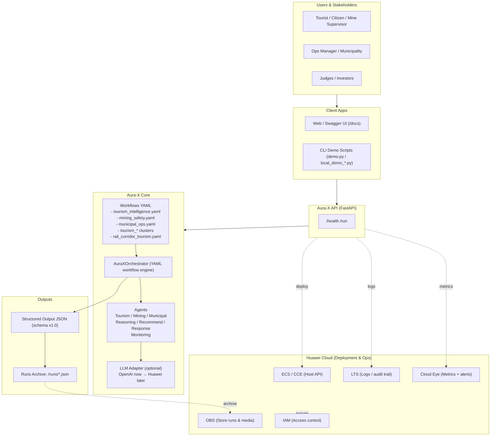

## 🏗 System Design Philosophy

Aura-X follows a modular, YAML-driven, multi-agent architecture.

Design principles:
- Workflow-driven orchestration
- Agent specialization per domain
- Provider-agnostic LLM integration
- Structured outputs for auditability
- Cloud-native deployment readiness (Huawei Cloud)

# Aura-X Diagrams

These diagrams explain the **architecture**, **data-flow**, and **workflows** for Aura-X.

## Contents
- [Architecture & Workflows](#-architecture--workflows)
- [System Architecture (High-Level)](#-1-system-architecture-high-level)

## 📐 Architecture & Workflows
See full system diagrams in this document.

---

## 1) System Architecture (High-Level)

### Agent: Tourism — Purpose & context
- Purpose: generate tourism intelligence and recommendations.
- Trigger: YAML workflow "tourism_intelligence.yaml" via /run API.
- Inputs: location, user profile, historical runs.
- Outputs: structured JSON recommendations, alerts.
- Audience: Ops managers, tourism analysts.
- Notes: fallback to LLM adapter if external reasoning required.

### Agent: Mining — Purpose & context
- Purpose: monitor mining-safety signals and produce risk assessments.
- Trigger: mining_safety.yaml workflows / sensor ingestion.
- Inputs: sensor telemetry, incident reports, schedules.
- Outputs: safety alerts, mitigation steps, run artifacts.
- Audience: Mine supervisors, safety engineers.
- Notes: enforce data-retention & audit via LTS/OBS.

### Agent: Municipal — Purpose & context
- Purpose: municipal operations recommendations and response planning.
- Trigger: municipal_ops.yaml workflows / scheduled runs.
- Inputs: municipal datasets, citizen reports.
- Outputs: operational plans, dispatch instructions.
- Audience: Municipality ops teams.
- Notes: integrate IAM-based access for sensitive data.

Short legend:
- Users: human stakeholders interacting with the system.
- Client: web/CLI entry points.
- API: FastAPI endpoints.
- Core: orchestrator, workflows, agents, LLM adapter.
- Outputs: structured run artifacts.
- Huawei: deployment/storage/ops services.

**LLM adapter — provider plan**
- OpenAI: used for initial prototyping.
- Huawei: planned for production (data‑residency / compliance).
Notes: implement a provider‑agnostic adapter; select provider via config/env var (e.g. AURA_X_LLM_PROVIDER). Document migration timeline and fallback behaviour in README/deployment docs.
